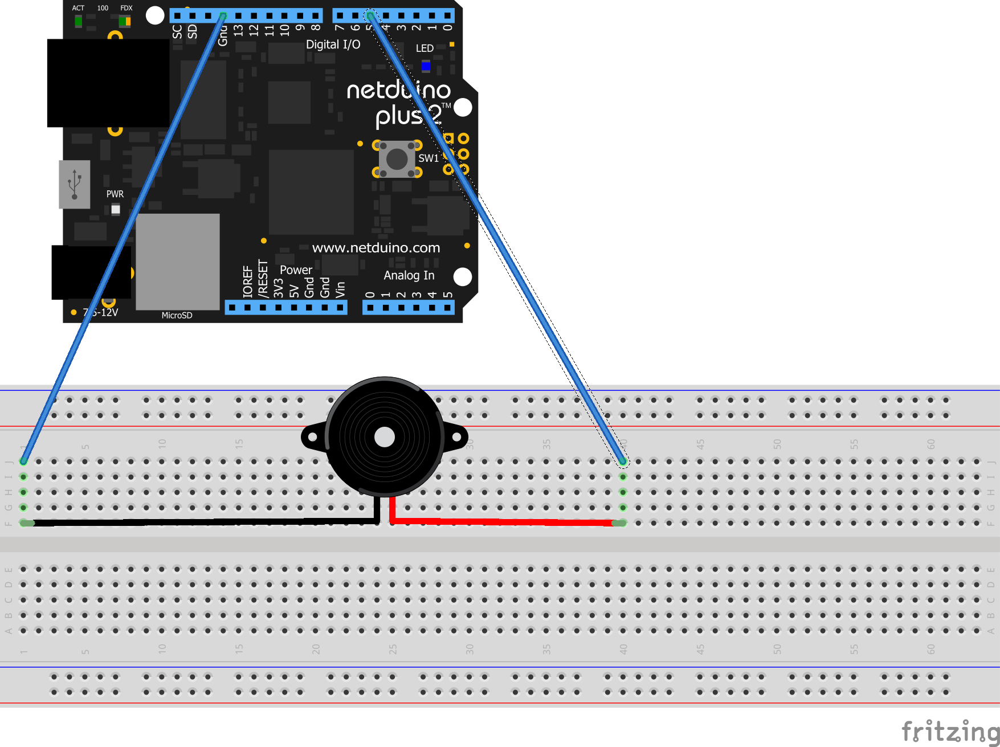

# Meadow-Piezo-JingleBells
Simple example of playing Jingle Bells with a Piezo speaker and a Meadow F7 Micro

## Circuit

Super simple, just slap your piezo into ground and D05:

## Running

Select your meadow board and deploy it!
